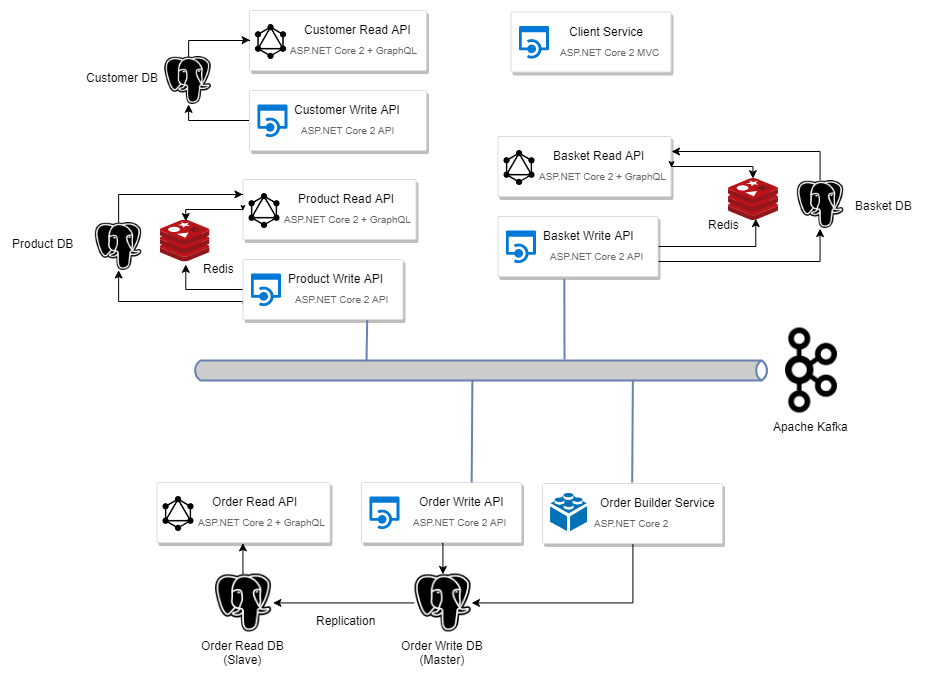

# ProjectG

## What is it

This project represents different system design approaches such as CQRS, Domain Driven Design, Event Driven Design.

## Infrastructure

It consists of the following services:

* Client Service
* Customer Service
  * Read API (based on GraphQL)
  * Write API
  * Database (PostgreSQL)
* Product Service
  * Read API (based on GraphQL)
  * Write API
  * Database (PostgreSQL)
  * Cache Server (Redis)
* Basket Service
  * Read API (based on GraphQL)
  * Write API
  * Database (PostgreSQL)
  * Cache Server (Redis)
* Order Service
  * Read API (based on GraphQL)
  * Write API
  * Database (PostgreSQL, master)
  * Read-Only Database (PostgreSQL, slave)
  * Order Builder Service

